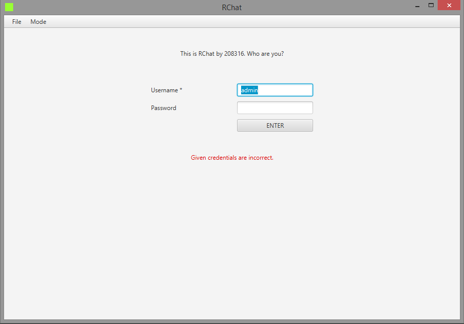
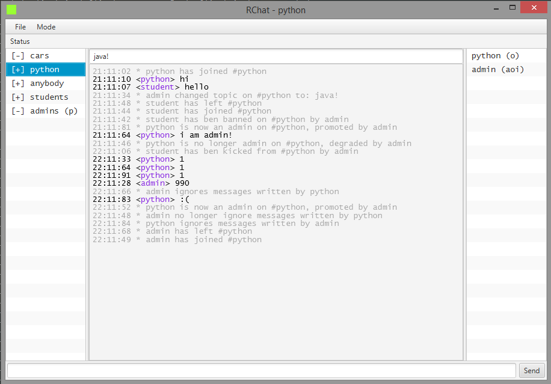

RChat  
* java 1.8, spring boot, apache.xmlrpc, com.caucho  
* features:
  - authorized (`a`), unauthorized users 
  - rooms (may be password-protected (`p`))
  - room topic
  - kick
  - ban
  - admin (`o`)
  - ignore (`i`)
  
* communication protocols (`mode`): 
  - Hessian  
  - Burlap  
  - XmlRpc
  

  
